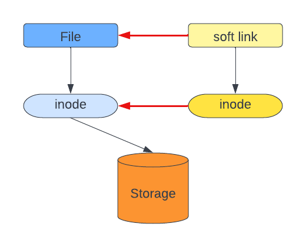
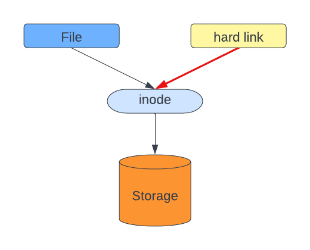

* Links = shortcuts to a destination / file
        = pseudo-files , bc the system in linux sees it as an obj opened from the location where it resides, not the original location

2 types : hard & soft

- how to create links :
    - ln Source Target - HARD LINKS
    - ln -s Source Target - SOFT LINKS

    - Source : original object
    - Target : actual link, the name

    ! if we create 2 links, one with the full path and one with a relative path, we can, even tho they direct us to the same file

difference between soft & hard links : the argument we use in ln

    * Inodes = index node, it serves as a unique identifier for a specific piece of metadata on a given filesystem, the disk blok location of this object

- how to remove links:

unlink LINK 

- difference between soft & hard links: 

SOFT LINK : 

        -> its like a pointer to the source
        -> it has a different inode from te file it points to => stored in diferent locations
        -> if the file is deleted, the softlink still exists as broken and cant be opened
        -> type : symbolic link
        -> in stat, it doesnt affect the nr of Links
        -> if we add the file again, everything is back to normal, bc the softlink is a pointer to the source

HARD LINK : 

        -> it has the same inode as the file it points to
        -> type : regular file
        -> in stat, nr of Links increases
        -> if the file is deleted, the hard link works as if nothing happened
        -> if we add the file again, the hard link will be seen as a different file, and it doesnt link to the file anymore, it exists independently with dif inodes
        -> cant be created for a directory, only for files
        -> a file exists until the last hard link is deleted

